## 简介
 Clash Meta for Android 是安卓系统上的一款 Clash 客户端

## 特性
 - 可随时切换代理模式及节点
 - 支持节点批量延迟测试
 - 通过托管链接一键配置
 - 规则命中分析
 - 日志输出

## 系统要求

 - 安卓 5.0+ (最低)（远古系统会提示无法解析安装包）
 - 安卓 7.0+ (推荐)
 - `armeabi-v7a` , `arm64-v8a`, `x86` or `x86_64` 架构CPU 

## 下载
 - 点击下面链接下载安装包

 - [下载地址1](https://ghproxy.net/https://github.com/MetaCubeX/ClashMetaForAndroid/releases/download/v2.10.2/cmfa-2.10.2-meta-universal-release.apk) \ 
  [下载地址2](https://mirror.ghproxy.com/https://github.com/MetaCubeX/ClashMetaForAndroid/releases/download/v2.10.2/cmfa-2.10.2-meta-universal-release.apk) \ 
  [下载地址3](https://github.moeyy.xyz/https://github.com/MetaCubeX/ClashMetaForAndroid/releases/download/v2.10.2/cmfa-2.10.2-meta-universal-release.apk) \ 
  [下载地址4](https://cf.ghproxy.cc/https://github.com/MetaCubeX/ClashMetaForAndroid/releases/download/v2.10.2/cmfa-2.10.2-meta-universal-release.apk)
 
 - 各地址的区别只是加速站的地址不同，下载后的安装包是一样的 (请不要在微信或者QQ中打开本页面，会被屏蔽，建议使用手机自带浏览器打开)

## 安装
 
 - 像安装其他应用一样将应用安装到手机或PAD (正确的应用图标如下图)  
 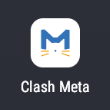

## 添加订阅
 Clash Meta for Android 支持两种导入配置文档的方式
 - URL（订阅）
 - 本地导入 （本教程不涉及）

 ### 启动Clash Meta
 - 启动后点击配置选项卡 (下图红框位置)
 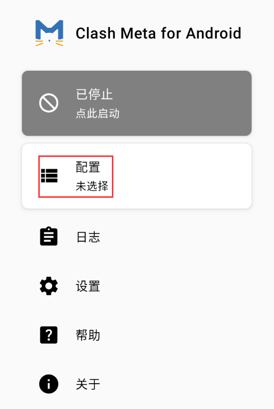

 ### 点击右侧加号
 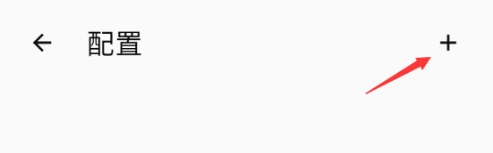

 ### 点击从URL导入
 - 下图红框位置
 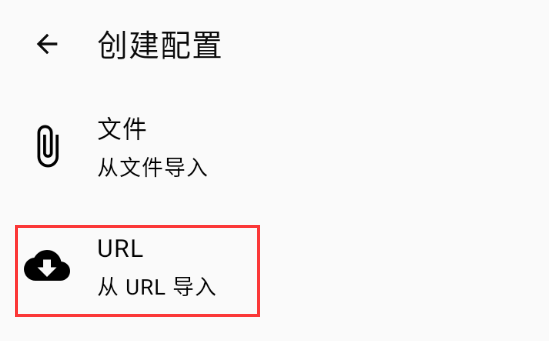
 
 ### 修改订阅名称
 - 点击修改名称，注意订阅名称不可重复 (下图红框位置)
 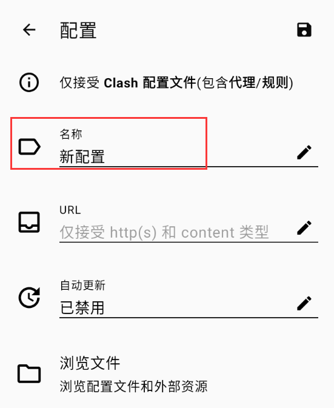

 ### 复制订阅地址
  - 复制下面任一链接 (可通过链接上的复制小按钮复制到剪切板)
   ```text
   https://ghproxy.net/https://raw.githubusercontent.com/anaer/Sub/main/clash.yaml
   ```

   ```text
   https://ghproxy.net/https://raw.githubusercontent.com/ermaozi/get_subscribe/main/subscribe/clash.yml
   ```

   ```text
   https://gitlab.com/free9999/ipupdate/-/raw/master/backup/img/1/2/ip/clash.meta2/1/config.yaml
   ```

 ### 修改订阅地址
 - 点击URL (下图红框位置)
 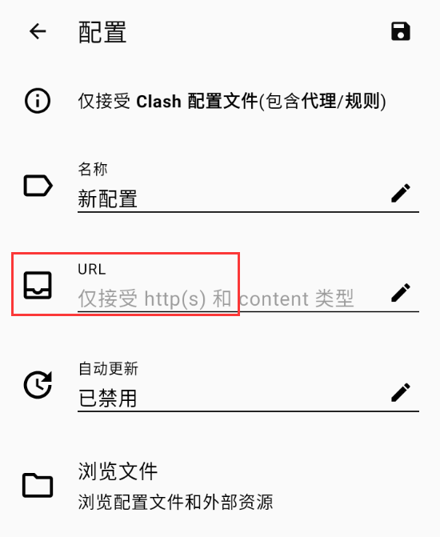
 - 将上面的地址复制到地址栏后点击确认
 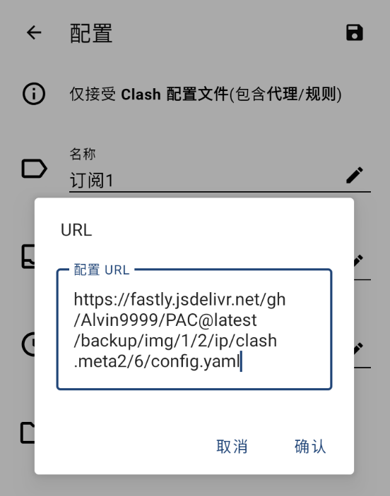
 - 点击右上角保存图标
 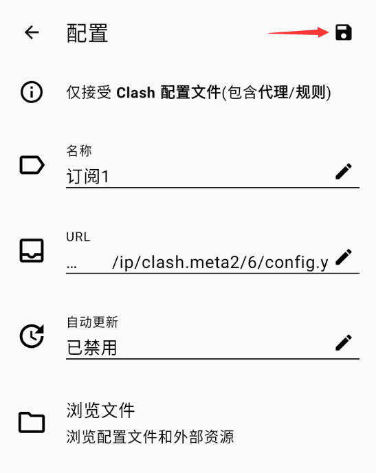
 - 如果一切顺利就会是下图的样子
 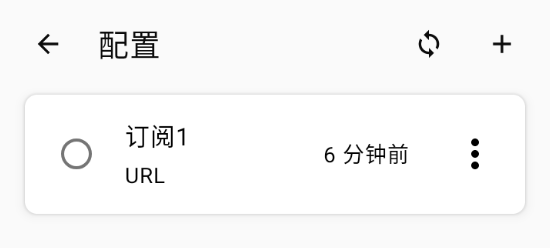

## 激活Clash Meta
 - 点击刷新按钮更新订阅 (下图红框位置)(可选)
 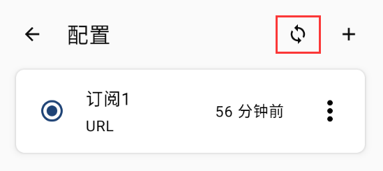
 - 选中你要激活的订阅后点返回按钮 (下图红框位置)
 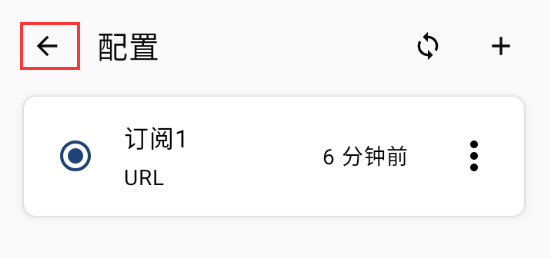
 - 点击启动按钮 (下图红框位置)
 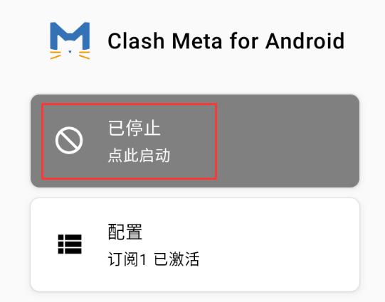
 - 启动过程中可能会遇到安全提醒，可安心放行
 - 恭喜你现在可以畅游网络世界啦！
 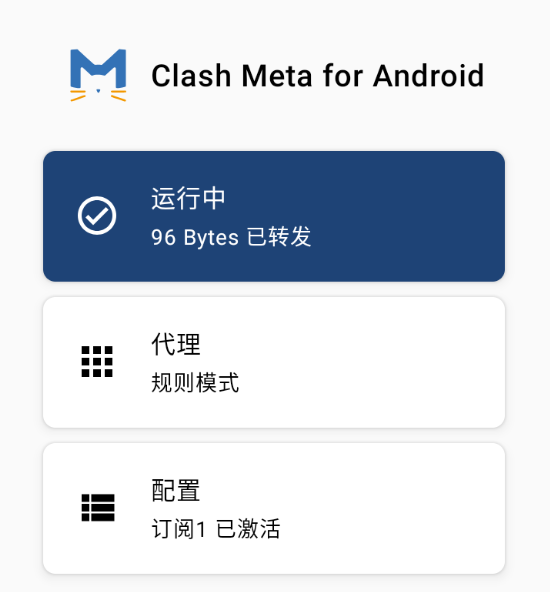
 
## 更多订阅
 - 本文分享的订阅均搜集自互联网，无法保证安全性跟可用性。可点击下方链接搜索更多订阅地址  
  [点我搜索订阅地址](https://www.google.com/search?q=clash.meta+%E8%AE%A2%E9%98%85+github&oq=clash+%E8%AE%A2%E9%98%85+github)

 - 注意clash订阅有多种格式，搜索到的订阅地址不可用是正常现象，本文分享的地址已经过测试
 - 还有一些订阅地址需要加速才能访问，这个技巧会在其他教程中讲述
 - 如果家里有电脑，推荐在安卓模拟器中使用，环境相对干净，也不用担心所有流量都被APP代理
